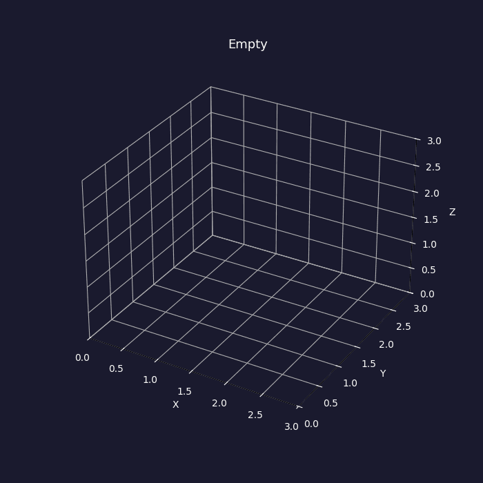

# Professor Cubazoid's 3D Tetris

**STA 561 — Final Project**

A solver and visualiser for the 3D polycube-packing problem: given a bag of
polycube pieces (each 3–5 unit cubes), decide whether they can be assembled
into a perfect $N \times N \times N$ cube, and if so produce an explicit
packing and an animated piece-by-piece construction.



*Piece-by-piece assembly of the Soma cube (7 polycubes → 3×3×3). See `case_visuals/gifs/` for all 17 solved cases.*

---

## Problem

> Input: a list of 3D binary tensors, each encoding a connected polycube.
> Output: a configuration of the pieces that forms a perfect cube, or `null`.

Pieces may only be **rotated** (24 proper rotations), not reflected.  Identical
pieces may appear multiple times.

## What's here

- **Exact backtracking solver** with three layers of pruning
  - 3D-checkerboard parity feasibility DP (microseconds, rejects many
    infeasible bags before the search even starts)
  - most-constrained-variable piece ordering
  - per-placement connectivity + subset-sum prune on the free region
- **Symmetry breaking** for identical pieces via canonical form
- **3D visualiser** (static snapshot + animated construction)
- **25-case benchmark suite** covering $2^3$ through $5^3$ cubes, infeasible
  inputs, and malformed inputs

## File layout

```
.
├── README.md
├── requirements.txt
├── executive_summary.docx
├── FAQ.pdf
├── technical_appendix.docx
├── results.csv                # benchmark output (top-level mirror)
├── case_visuals/              # per-case input PNGs + construction GIFs
│   ├── previews/
│   ├── gifs/
│   └── index.md
└── code/
    ├── solver.py              # solver logic + 24-rotation handling + validation
    ├── visualize.py           # static and animated 3D rendering (matplotlib)
    ├── test_suite.py          # 25-case classification benchmark + CSV export
    ├── benchmark.py           # original short benchmark (kept for compatibility)
    ├── demo.py                # minimal script demo
    ├── demo.ipynb             # Jupyter notebook walk-through (this is the one to run)
    ├── make_case_gifs.py      # regenerates case_visuals/
    └── results.csv            # benchmark output
```

## Requirements

- Python ≥ 3.9
- `numpy`, `matplotlib`, `pillow` (GIF export), and for the notebook also
  `jupyter` and `pandas`.

Install with:

```bash
pip install -r requirements.txt
```

## Quick start

```bash
# (1) run the 25-case benchmark
python test_suite.py --timeout 15

# (2) run the short demo + view a solution animation
python demo.py

# (3) walk through everything with plots in the notebook
jupyter notebook demo.ipynb
```

Expected output from `test_suite.py` on a modern laptop: **25/25 classification
passes, 17 puzzles solved, worst case ~4 seconds** (on a hard $5^3$ random
partition).

## How to call the solver

There are two public entry points in `code/solver.py`.

### `solve(pieces, timeout_sec=30)` — spec-compliant wrapper

This is the function that matches the project spec literally:

> *"gives as output a configuration of the objects that forms a perfect
> cube if such a configuration exists and it returns null otherwise."*

```python
from solver import solve

# `pieces` is a list of 3D binary tensors.  numpy int/bool/float arrays
# and nested Python lists are all accepted; any nonzero value is treated
# as an occupied cube.
configuration = solve(pieces)

# configuration is either:
#   - a numpy.ndarray of shape (N, N, N), dtype int, where cell value
#     k > 0 means that cell is occupied by input piece number k-1 (so
#     piece IDs are 1-indexed in the grid), or
#   - None if no valid packing exists, the input is malformed, or the
#     solver exceeded timeout_sec.
```

`solve()` never raises — invalid input returns `None` instead of an
exception. Use this if you only need the packed cube.

### `solve_final(pieces, timeout_sec=15)` — full diagnostic API

Use this when you *also* want the per-piece placement order (so the
animation replays the search path), the runtime, node/prune counts,
and a precise reason for any non-solved outcome. This is what
`test_suite.py`, `demo.py`, and `visualize.py` call internally.

## Solver return format

```python
result = solve_final(pieces, timeout_sec=15.0)

result["status"]            # one of:
                            #   "solved", "no_solution", "timeout",
                            #   "parity_rejected", "invalid_volume",
                            #   "invalid_input"
result["N"]                 # cube side length
result["runtime_sec"]
result["grid"]              # N x N x N numpy array of piece_idx+1 (or 0)
result["placements"]        # list of {piece_rank, piece_idx, cells}
                            # in SOLVER placement order (→ animation-ready)
result["placements_by_piece_idx"]  # same, sorted by original piece id
result["stats"]             # {nodes, places, prunes_connectivity}
```

## Algorithm overview

1. **Validate** each piece: 3D, binary, non-empty, 6-connected.
2. **Check volume**: $\sum |p_i|$ must be a perfect cube → infer $N$.
3. **Parity feasibility DP**: colour the cube as a 3D checkerboard.  Every
   piece, under rotation *and* translation, contributes one of a small set
   of (even, odd) signatures.  A DP over pieces checks whether the bag can
   match the cube's totals.
4. **Order pieces** by number of valid (orientation, translation)
   placements, fewest first, with larger volume as tie-breaker.
5. **Backtrack** using a running "first empty cell in lex order" pointer:
   - At each step, find the first empty cell $c$.
   - For every unplaced piece (skipping rotational duplicates via canonical
     form), for every orientation anchored so that the piece's lex-minimum
     cell lands at $c$, attempt placement.
   - After a successful placement, run the connectivity+subset-sum prune
     on the remaining free region.
   - Recurse; undo on failure.
6. **Return** the placements in the order they were laid down, so the
   animation is a literal replay of the search's final path.

## Known limitations / future work

- The solver is pure Python; a **bitboard representation** and a
  **dancing-links (Algorithm X) exact-cover rewrite** would give another
  5–20× on hard 5³ cases.
- No GPU, no learned heuristic.  Literature suggests a learned value
  network could guide piece-ordering on very large cubes, but the gain
  over current exact search at $N \le 5$ is marginal.
- Reflections are not permitted — a left-handed piece cannot be placed as
  its right-handed mirror.  This matches the problem statement.

## Reproducing the results in the report

All numbers in the executive summary and FAQ are emitted by
`test_suite.py --save results.csv` and the benchmark cells of
`demo.ipynb`.  No randomness outside of the three fixed-seed random
partitions inside `test_suite.py`.

---
